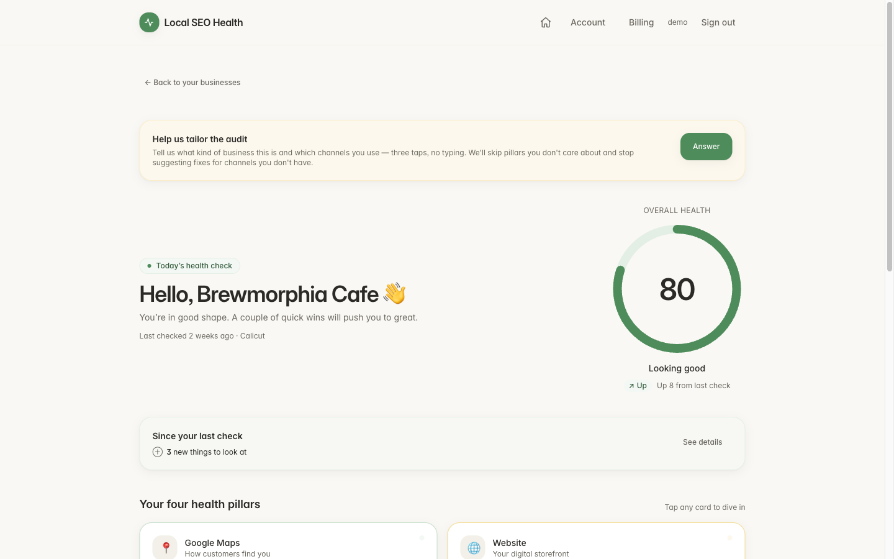
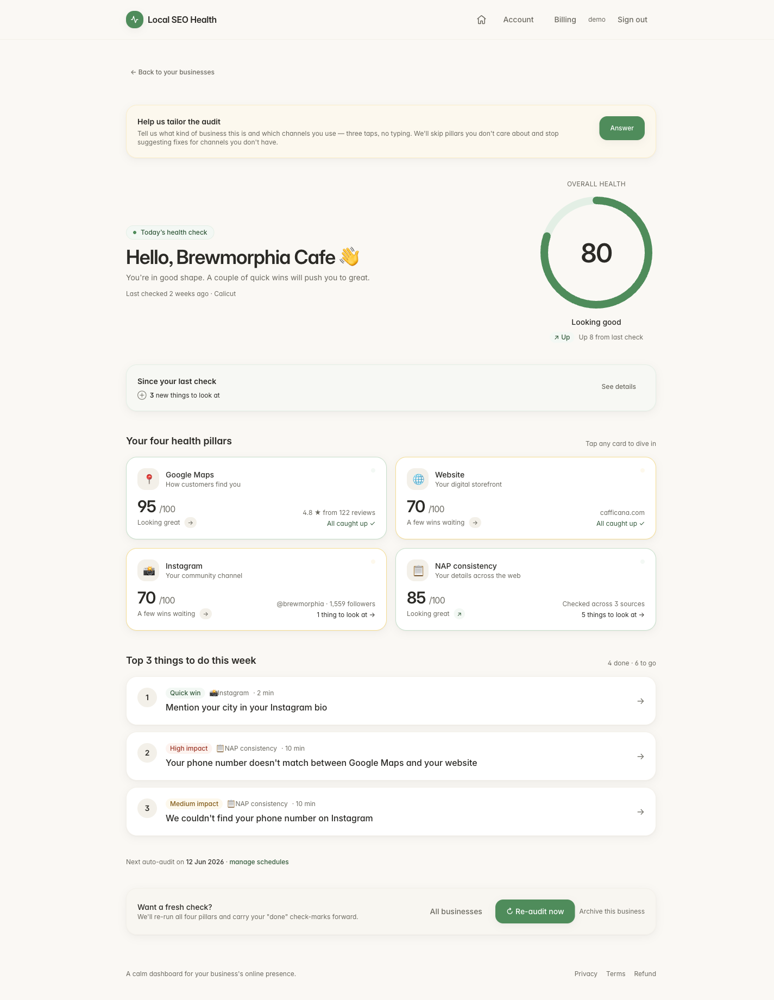
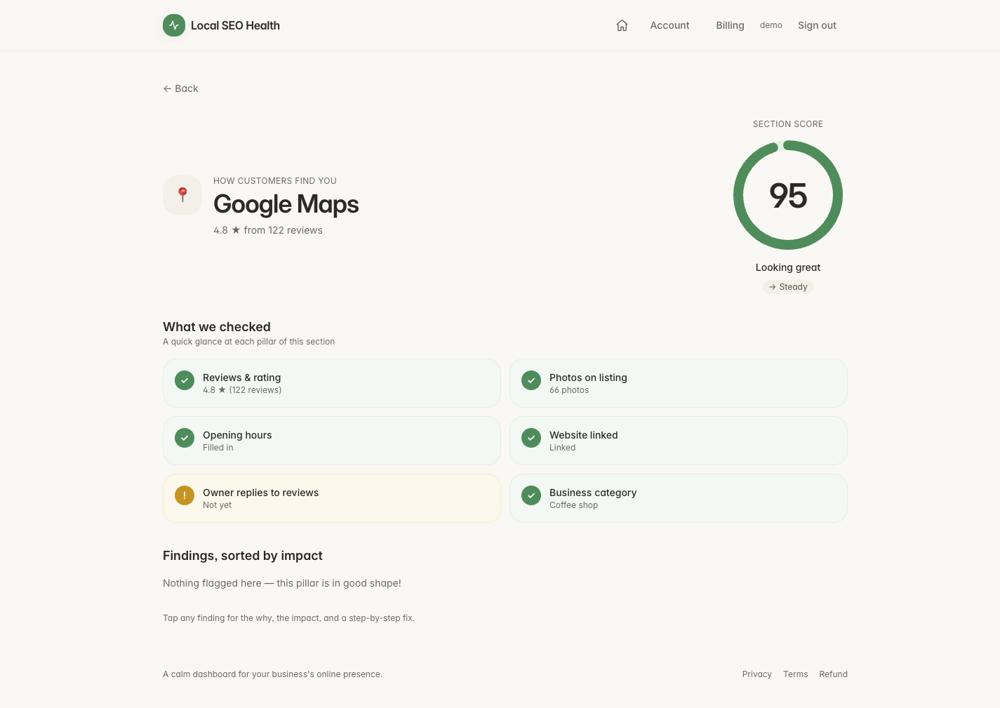
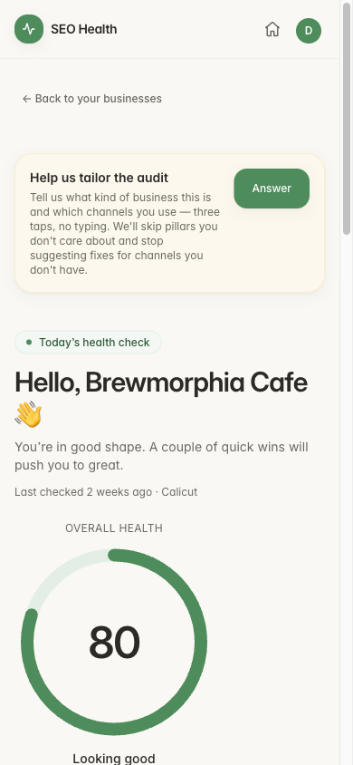

# SEO Health

**Visibility intelligence for local businesses.** SEO Health audits how a small
business shows up online — its Google Business Profile, website, and social
presence — scores it, tracks competitors, and turns the gaps into plain-English,
prioritized fixes. Not a metrics dashboard; an advisor that tells you *what to do
next*.

> ⚙️ **Status:** in active development. Core product (audits, competitor
> tracking, subscriptions, PWA + push) is built and running; production deploy
> and live billing are in progress.



---

## What it does

A small-business owner enters their business name + city. SEO Health then runs a
multi-pillar audit and presents it as a calm, three-layer workspace:

- **Layer 1 — the scoreboard:** an overall visibility score with per-pillar
  cards (Google Maps, Website, Instagram, NAP consistency) and week-over-week
  trends.
- **Layer 2 — the pillar:** drill into a pillar to see exactly what was found.
- **Layer 3 — the finding:** each issue opens to a specific, do-this-next
  recommendation with estimated impact and effort.

| The full check, top to bottom | A pillar, up close | On mobile |
|---|---|---|
|  |  |  |

## Features

- **Automated visibility audits** across Google Maps, website, Instagram, and
  NAP (name/address/phone) consistency — with a **live-streamed progress feed**
  (Server-Sent Events) so the user watches each pillar complete in real time.
- **Deterministic scoring + prioritized recommendations** — no generic AI
  filler; every finding is a concrete, ranked action.
- **Competitor tracking & discovery** — track competitors manually or via a
  rule-based discovery scan; a global, URL-deduped cache keeps trend data fresh
  without re-scraping.
- **Scheduled auto-audits + weekly email digest** on a per-business cadence.
- **Web push notifications** (PWA) — "your scheduled audit is in", "a competitor
  is pulling ahead" — via VAPID/Web Push.
- **Tiered subscriptions** (Free / Pro / Max) with Razorpay billing.
- **Installable PWA** — home-screen app, offline shell, push.
- **Founder admin panel** — users, MRR, conversion, queue depth, scaling
  triggers.

## Tech stack

| Layer | Tech |
|---|---|
| **Frontend** | SvelteKit (Svelte 5 runes), adapter-static SPA, Tailwind CSS, PWA (service worker, Web Push) |
| **Backend** | FastAPI (Python 3.12), SQLAlchemy 2.0, Alembic, Pydantic |
| **Data** | PostgreSQL (prod) / SQLite (dev), Redis |
| **Workers** | RQ + rq-scheduler; Selenium / undetected-chromedriver, httpx + BeautifulSoup for scraping |
| **Auth** | Passwordless magic-link + HttpOnly cookie sessions |
| **Email / Billing / Push** | Resend · Razorpay · VAPID Web Push |
| **Infra** | Docker Compose, Nginx, Caddy (automatic TLS), Sentry, slowapi rate limiting |

## Architecture highlights

- **Async audit pipeline** — a user-triggered or scheduled audit is enqueued to
  RQ; a worker runs the Selenium/HTTP scrapers pillar-by-pillar and publishes
  progress to a Redis stream, which the frontend consumes over SSE for a live
  feed. Terminal state is gated on Google Maps actually loading, so half-scraped
  audits can't report a confident-looking score.
- **Two worker pools** — a foreground audit worker and a low-priority competitor
  worker (cache refreshes + discovery scans) on a separate queue, so a 10-minute
  competitor scrape never starves a user's live audit.
- **Scheduler** — cron-driven auto-audits (spread across hourly buckets to avoid
  a thundering herd), the weekly digest, competitor refreshes, and storage
  pruning.
- **Stateless, horizontally-scalable** — clean relational schema, retention
  pruning, and an enqueue-based pipeline designed to scale workers out as volume
  grows.

## Running it

The full stack runs under Docker Compose:

```bash
# Dev (uvicorn --reload, source mounts, ports republished)
docker compose -f docker-compose.yml -f docker-compose.dev.yml up -d --build

# Production-shaped, with HTTPS via Caddy
docker compose --env-file .env.prod \
  -f docker-compose.yml -f docker-compose.prod.yml -f docker-compose.caddy.yml \
  up -d --build
```

See `.env.prod.example` for configuration. Migrations run automatically on API
container start.

---

*Built by [Adwaith Jayakrishnan](https://github.com/adwaithjk98-jpg). Solo
full-stack project — product, design, frontend, backend, scraping, and infra.*
